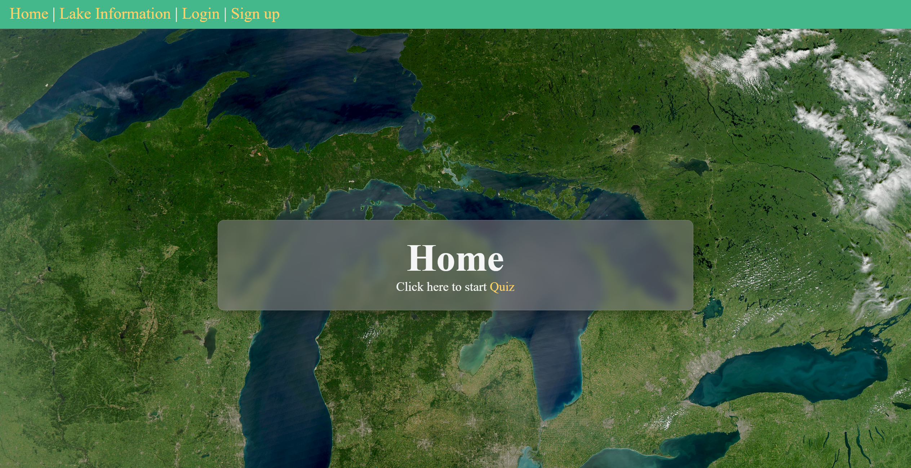
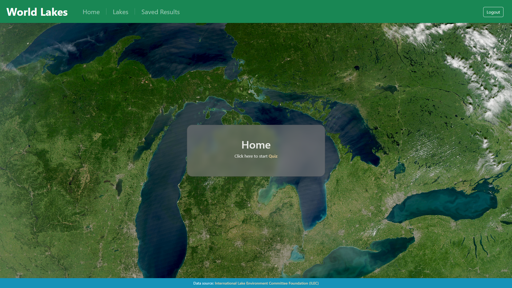
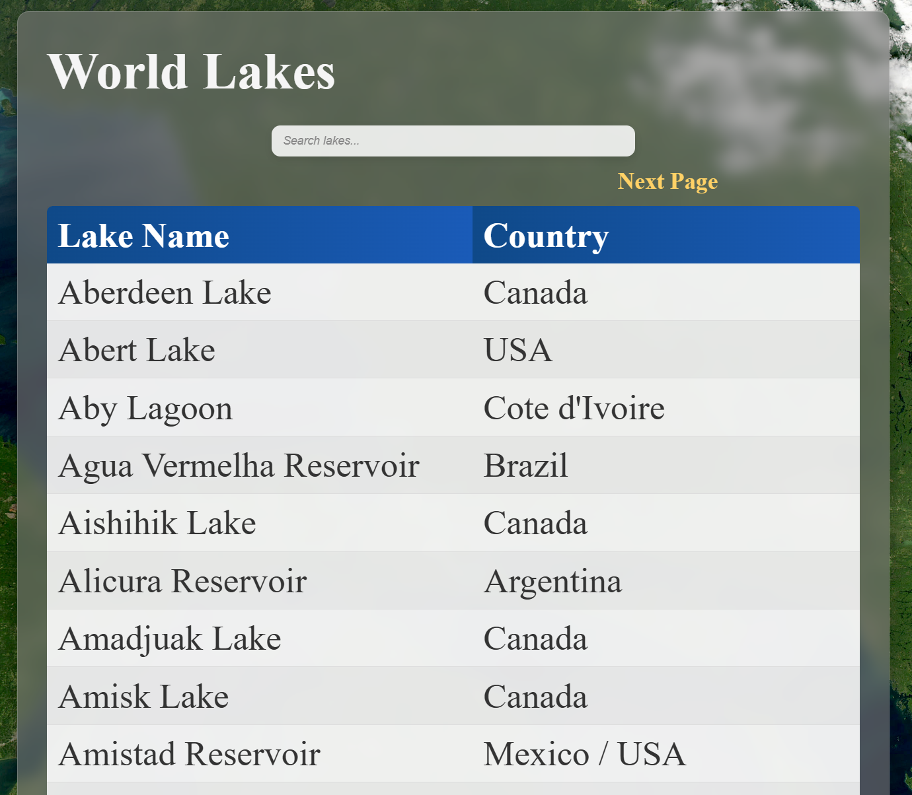
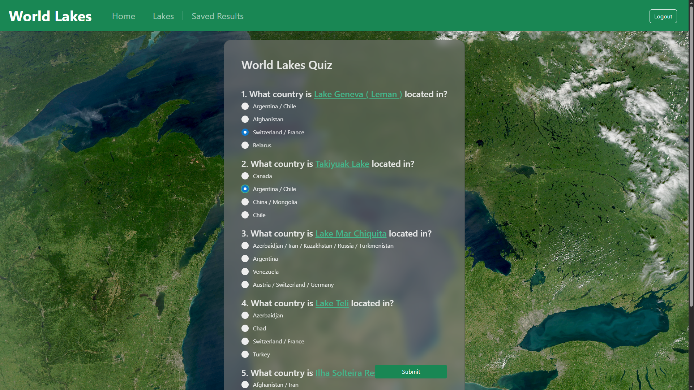
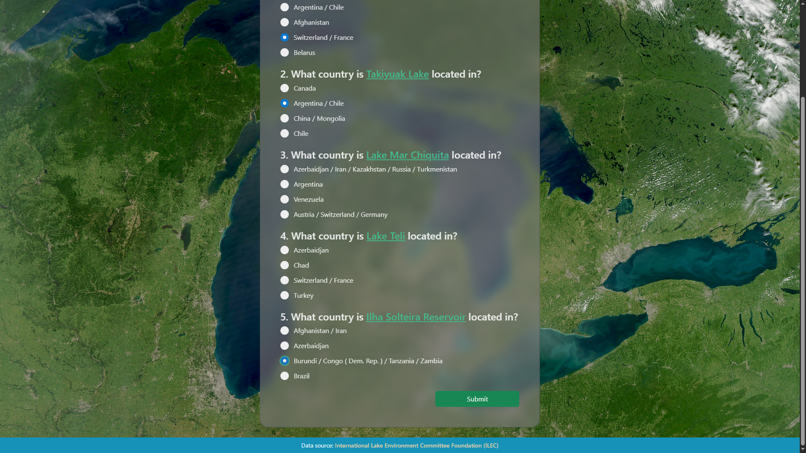
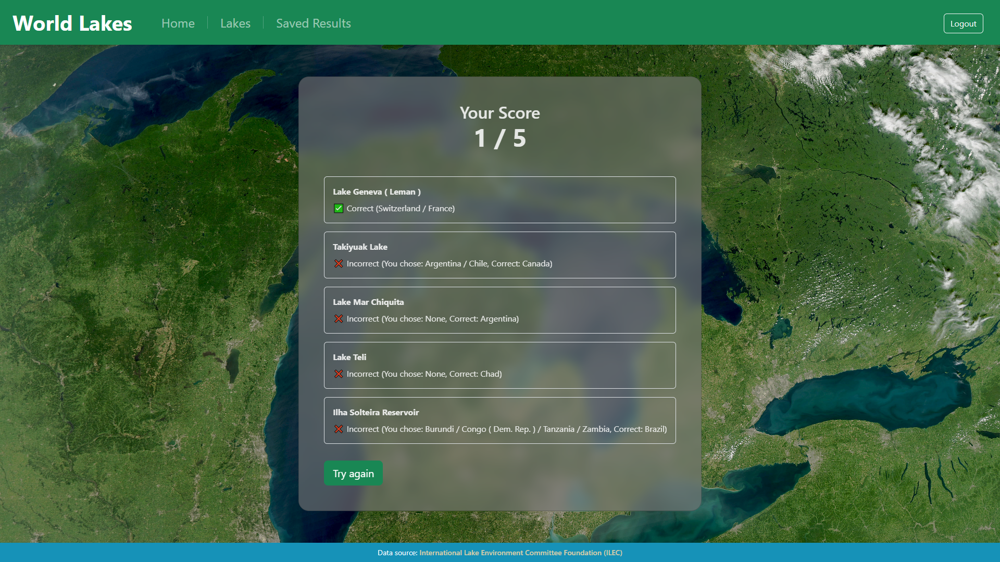
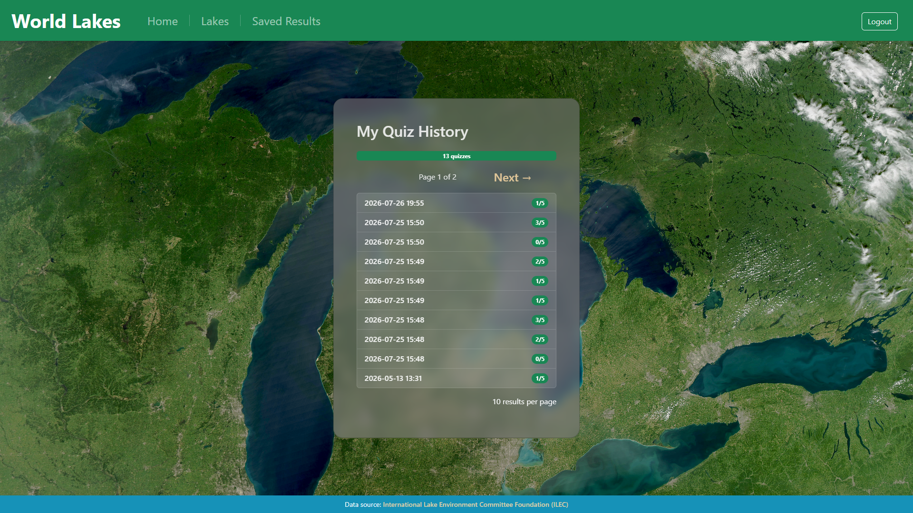
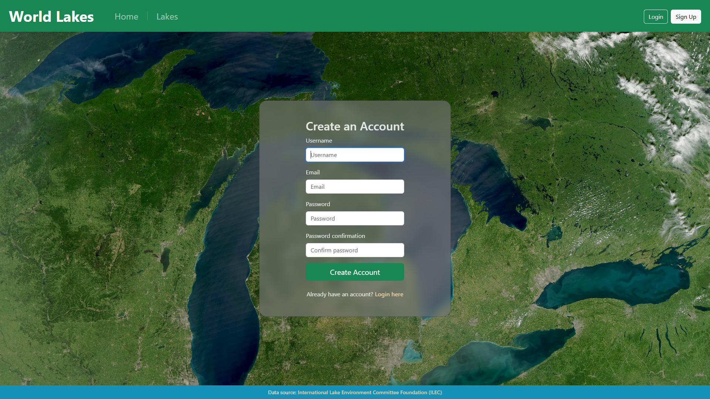
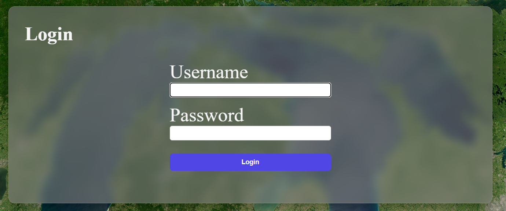

## 🌍 Lakes of the World Quiz – Django App

### ✨ Highlights

- Django web application
- Responsive Bootstrap 5 interface
- User authentication
- Oracle ATP and SQLite support
- Dynamic quiz generation
- Searchable lake database
- Tests covering core application functionality

### 📖 Description  
A Django web application that generates geography quizzes based on real-world lake data. Users can take randomized quizzes, browse a searchable database of lakes, and (when signed in) save their quiz results. The project demonstrates user authentication, relational data modeling, dynamic quiz generation, and responsive UI design using Bootstrap.

### 🛠 Technologies

#### Backend
- Python 3.11+, 
- Django  
- Database: Oracle ATP / SQLite3 (optional)

#### Frontend
- HTML, 
- CSS, 
- Bootstrap 5

#### Other 
- Git  


### ⚡ Features

- Randomized 5-question multiple-choice quiz
- Searchable database of world lakes
- User registration and authentication
- Save quiz results to a personal account
- Guest mode and authenticated mode
- Responsive interface built with Bootstrap 5
- Data imported from International Lake Environment Committee Foundation

### 📁 Project structure
```
worldLakeQuizApp/  
├── worldLakeQuizApp/           # Project configuration
├── users/                      # Authentication  
├── lakes/                      # Lake data
├── quiz/                       # Quiz logic
├── templates/  
├── static/   
└── manage.py  
```

### 🖼️ Core Interface Views

<details>
<summary><b>🏠 Home Page (Guest and Authenticated)</b></summary>

<p align="center">
  
  
</p>

</details>

<details>
<summary><b>🔍 Lake Browsing Page</b></summary>



</details>

<details>
<summary><b>✍️ Quiz Page</b></summary>
    
<p align="center">
  
  
</p>

</details>

<details>
<summary><b>🏆 Quiz Results Page (for everyone) and Saved Results Page (for authenticated users only)</b></summary>

<p align="center">
  
  
</p>

</details>

<details>
<summary><b>🔐 Authentication Pages (Sign Up & Sign In)</b></summary>

<p align="center">
  
  
</p>

</details>

### 🚀 Local Setup

**Clone the repository**
```
git clone https://github.com/marc32132/worldLakeQuizApp.git
cd worldLakeQuizApp
```
**Create and activate a virtual environment**

```
python -m venv venv 
source venv/bin/activate  # Linux / macOS 
venv\Scripts\activate     # Windows
```
**Install dependencies**
```
pip install -r requirements.txt
```

**Create a `.env` file in the project root containing**

```
SECRET_KEY="your-secret-key"
```

⚠️ **Database Setup Note**  

To run the project locally with the included sample data, use **SQLite3** by adding the following to your `.env` file:

```
USE_SQLITE=True
```

If `USE_SQLITE` is not specified (or is set to False), the application will use the Oracle ATP configuration.


**Run the migrations and insert data**
```
python manage.py migrate
python manage.py import_csv
```


**Run the Django server**
```
python manage.py runserver
```
**Open the application in your browser at: `http://127.0.0.1:8000/`**


### 🧪 Testing

The project includes **44 tests** covering:

- Models
- Forms
- Views
- Authentication
- Quiz generation
- Search functionality

Run the test suite with:

```
python manage.py test
```


 
📌GitHub:  
https://github.com/marc32132
